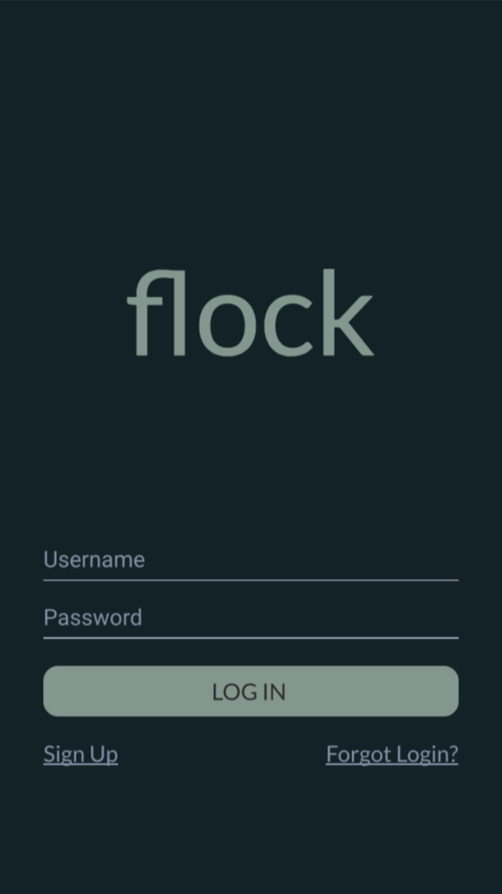

# Flock
We are a TravelCompanion app. We aim to give people options that would be less dangerous than taking the subway solo. A normal scenario would be a user setting up and account. Then putting the parameters of their travel and seeing if there are any other users who match their route. If there are, they will have the chance to scroll through and visit their profiles. Once they decide on a person, then a notification would be sent to the other user for them to confirm or deny the invitation. If there are no people that match your route, you will have the option to create an event in hopes that someone would be interested in travelling with you. These events could be set up days in advance.
We understand that this comes with its fair share of risks so we intend to mitigate these risks by offering a rating system along with having users pair their facebook so that the user can be confident that the person that they have agreed to ride 
with is the person that is referenced in their profile. Also, the user will have a chance to accept the person before the 
connection is established so there are minimal surprises. 

# Challenges we ran into:
*
*
*

# Instructions
```

# Make sure you have your Android Studio and Java installed.

# Clone the app in your computer
git clone https://github.com/CUNYTech/EventApp.git

# open the Android studio, click "open existing android studio project"

# Find the directory where you cloned your app and click "ok"

# Click on compile and run the project

```

# TechStack: 
* Java		
* Firebase (Backend, Restful API, Authenication)

# Mockup of the App:

 
